# 3d_detection

# OpenPCDet 흐름

- dataset과 model config 파일은 사전에 정의되어 있다고 가정

## train.py 시작

- parse_config 함수
  - 설정들 정의
  - cfg_from_yaml_file
    - 사전 정의된 model config파일의 내용을 사용할 config 파일에 합친다.
    
  - 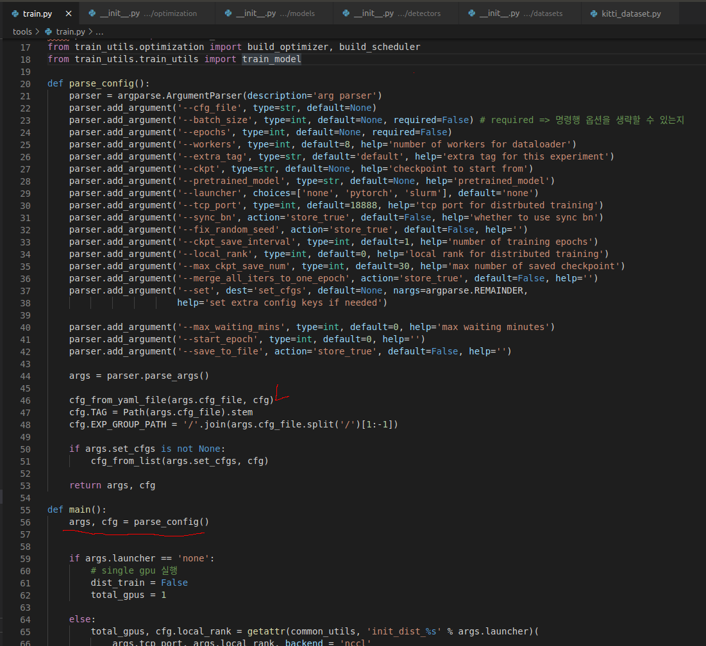

- dataload 하기
  - 사용할 config 파일에서 dataset, class name 등 내용과 함께 데이터로드
  - datasets/__ init __.py 에 정의되어있는 build_dataloader와 연결
  - 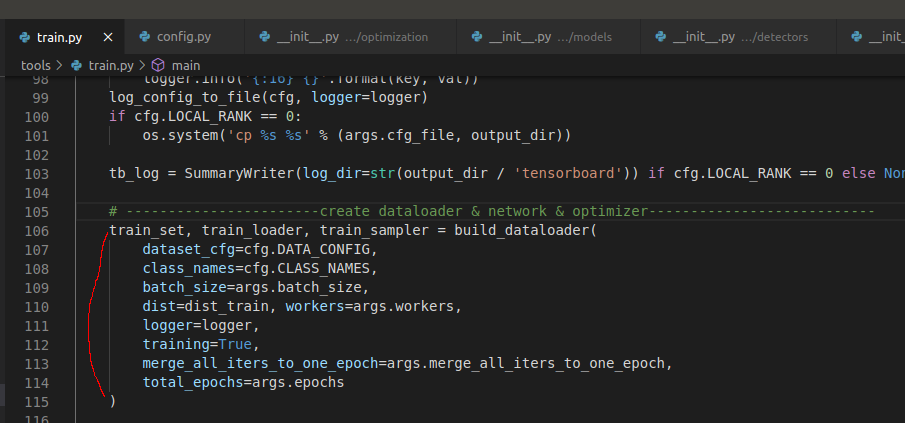
  - 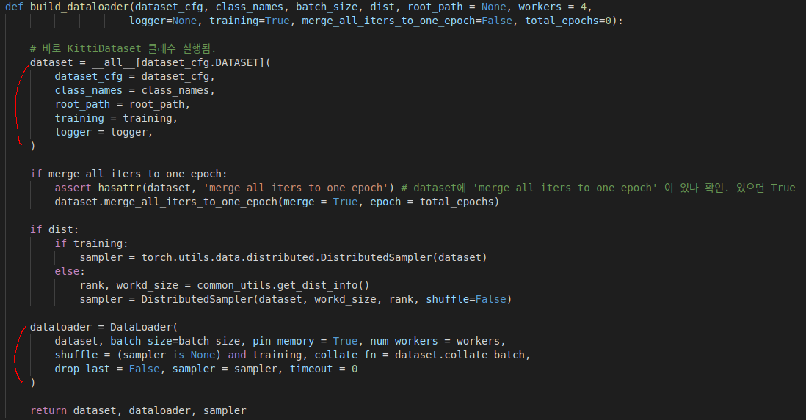
    - datasets/dataset.py의 DatasetTemplate클래스를 상속하는 datasets/kitti/kitti_dataset.py 클래스를 따라서 dataset이 정의됨
    - DataLoader함수는 파이토치에서 사용하는 설정들을 통해 정의된 dataset을 로드함.

- 네트워크(= 모델) 생성하기
  - 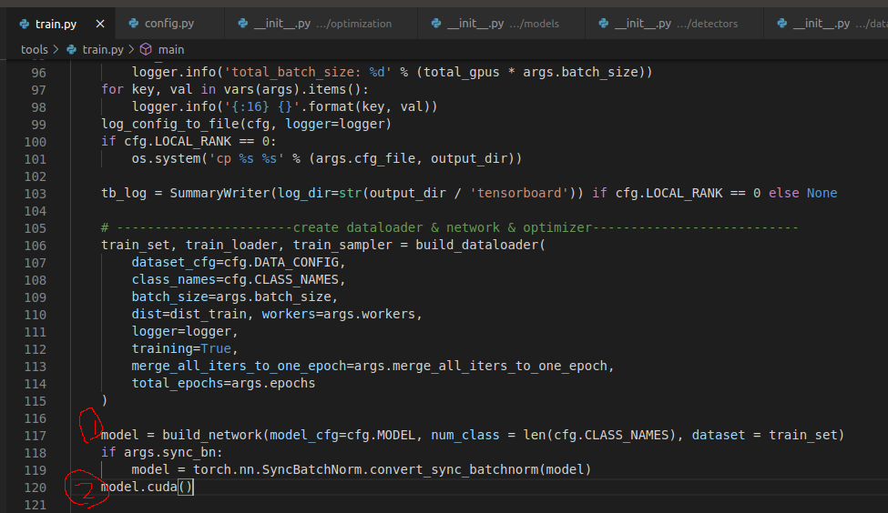
    - 1번 = 모델 생성
    - 2번 = 모델을 gpu로 돌릴준비
  - pcdet/models/__ init __.py
    - 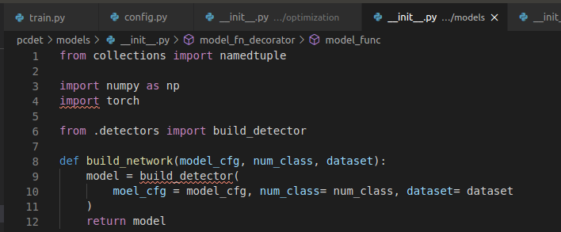
    - 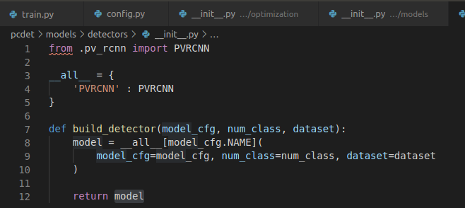
      - pcdet/models/detectors/__ init __.py 의 build_detector함수를 통해 PVRCNN 모델을 생성한다.
        - 사전 설정한 모델 config, 클래수 수, 데이터셋에 맞는 PVRCNN모델을 생성
        - pcdet/models/detectors/detector3d_Template.py 파일의 Detector3DTemplate 클래스를 상속하는 pcdet/models/detectors/pv_rcnn.py의 PVRCNN 클래스를 통해 모델을 생성함.
        - 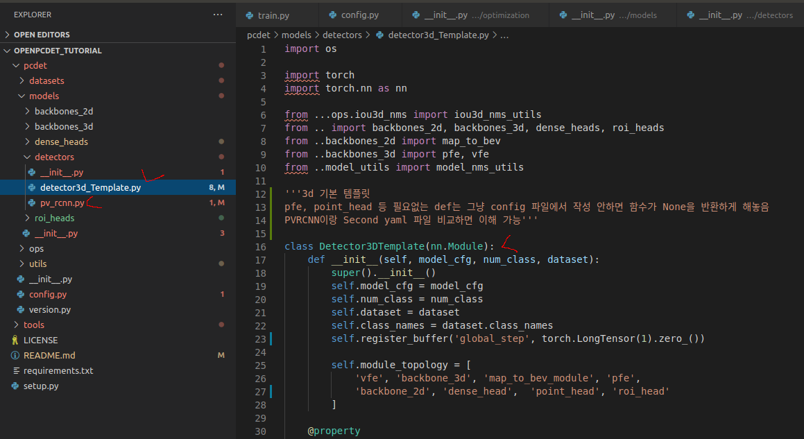
        - 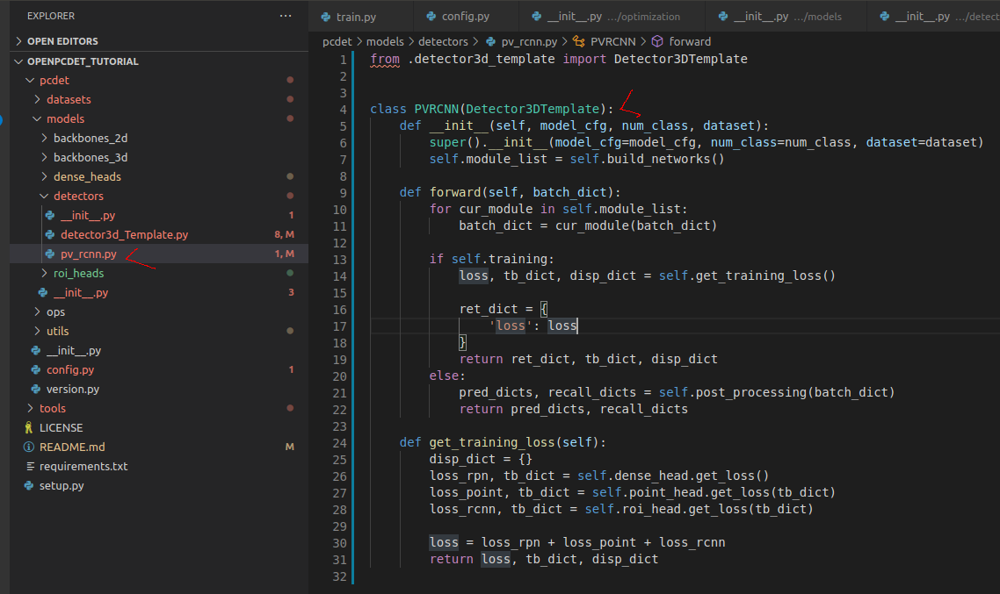

- Optimizer 생성
  - tools/train_utils/optimization/__ init __.py 파일의 build optimizer함수
  - 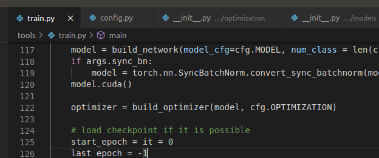
  - 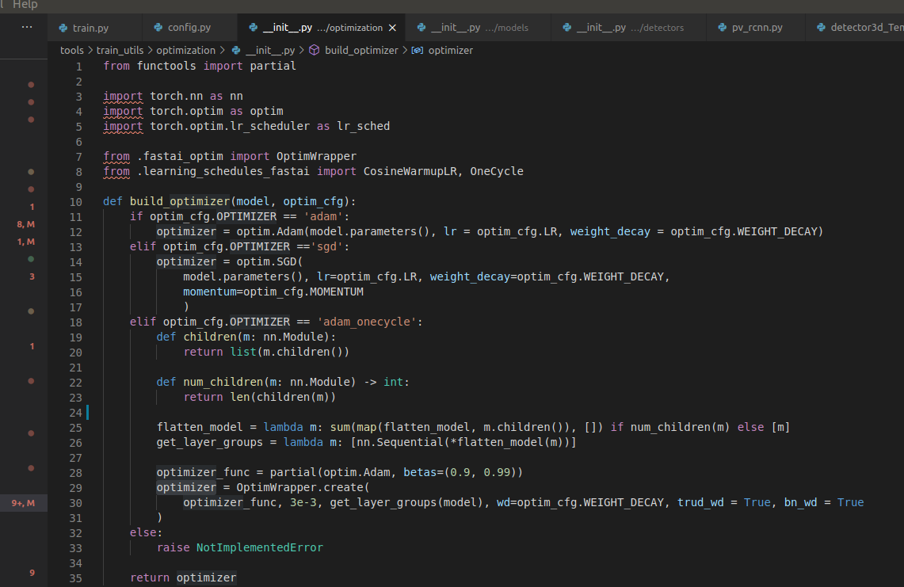
    - config 파일대로 adam_onecycle optimizer를 빌드하고 리턴함.

- 여기까지 dataset, network, optimizer를 config파일에 정의된 대로 생성했음. 이제 training을 시작
  - tools/train_utils/train_utils.py 파일의 train_model함수 실행됨.
  - 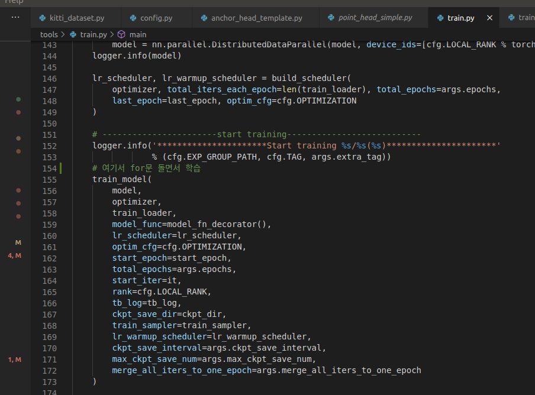
  - 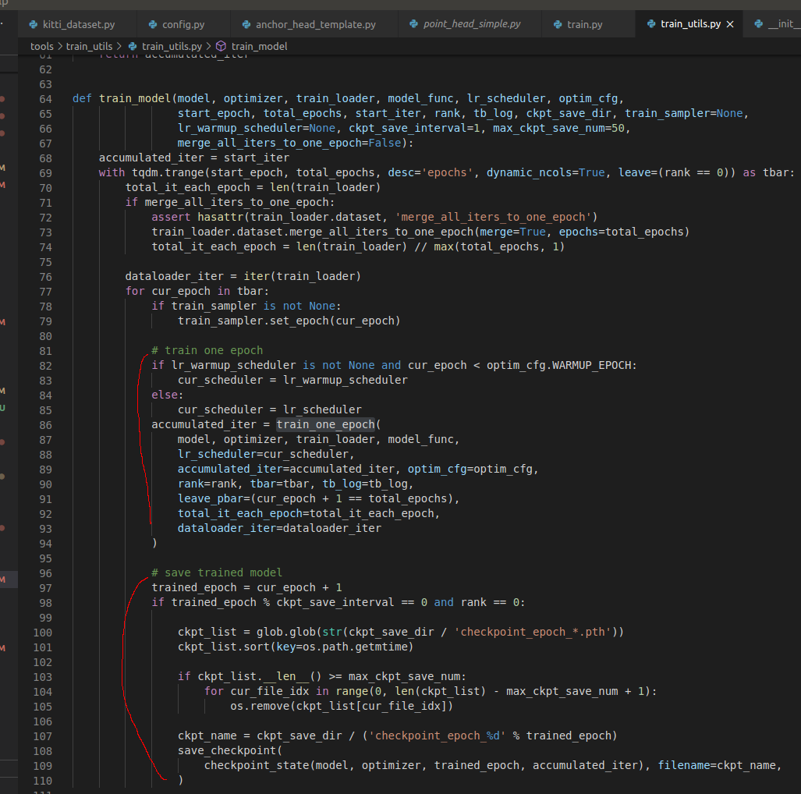
    - 한 에폭당 train과 model save(checkpoint)가 반복된다.

- Evaluation
  - 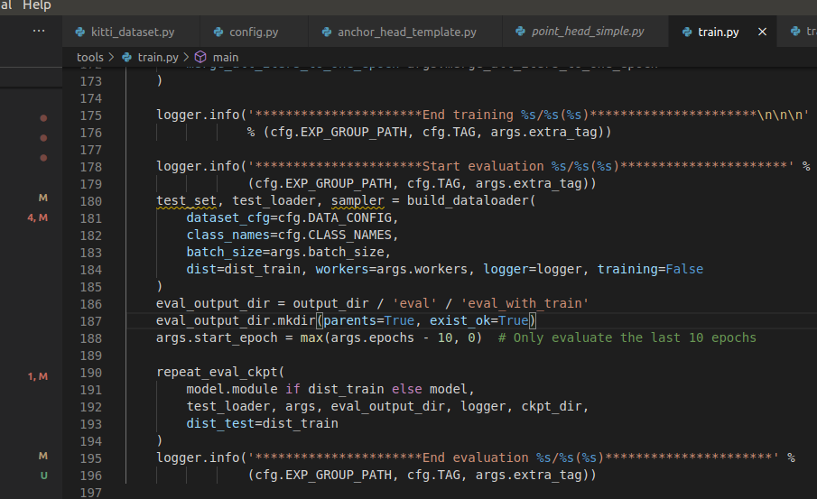
    - test dataset을 build하고 tools/test.py의 repeat_eval_ckpt 함수를 통해 evaluation을 수행한다.

## model

- model을 생성할 때 pvrcnn.yaml 파일에 정의한 네트워크가 빌드된다.
- pcdet/models/detectors/pv_rcnn.py는 detector3d_template.py를 상속하고있다.
  - pv_rcnn.py의 PVRCNN클래스가 실행될 때 vfe, backbone_3d, pfe 등 네트워크에 해당되는 코드들이 실행되면서 네트워크가 빌드됨.

